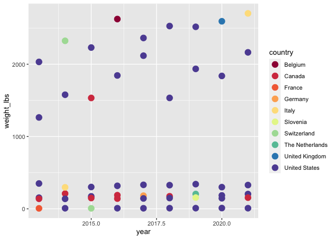

First TidyTuesday for MJ
================
Mark Jones
October 21, 2021

``` r
library(tidytuesdayR)
library(tidyverse)
```

    ## ── Attaching packages ─────────────────────────────────────── tidyverse 1.3.1 ──

    ## ✓ ggplot2 3.3.5     ✓ purrr   0.3.4
    ## ✓ tibble  3.1.4     ✓ dplyr   1.0.7
    ## ✓ tidyr   1.1.3     ✓ stringr 1.4.0
    ## ✓ readr   2.0.1     ✓ forcats 0.5.1

    ## ── Conflicts ────────────────────────────────────────── tidyverse_conflicts() ──
    ## x dplyr::filter() masks stats::filter()
    ## x dplyr::lag()    masks stats::lag()

``` r
library(lubridate)
```

    ## 
    ## Attaching package: 'lubridate'

    ## The following objects are masked from 'package:base':
    ## 
    ##     date, intersect, setdiff, union

``` r
library(RColorBrewer)

tt_available()
```

    ## Year: 2021
    ## 
    ##    Week       Date                            Data
    ## 1     1 2020-12-29  Bring your own data from 2020!
    ## 2     2 2021-01-05            Transit Cost Project
    ## 3     3 2021-01-12                 Art Collections
    ## 4     4 2021-01-19                    Kenya Census
    ## 5     5 2021-01-26               Plastic Pollution
    ## 6     6 2021-02-02                 HBCU Enrollment
    ## 7     7 2021-02-09               Wealth and Income
    ## 8     8 2021-02-16        W.E.B. Du Bois Challenge
    ## 9     9 2021-02-23         Employment and Earnings
    ## 10   10 2021-03-02                   SuperBowl Ads
    ## 11   11 2021-03-09                    Bechdel Test
    ## 12   12 2021-03-16            Video Games + Sliced
    ## 13   13 2021-03-23                        UN Votes
    ## 14   14 2021-03-30                   Makeup Shades
    ## 15   15 2021-04-06            Global deforestation
    ## 16   16 2021-04-13                 US Post Offices
    ## 17   17 2021-04-20                  Netflix Titles
    ## 18   18 2021-04-27                  CEO Departures
    ## 19   19 2021-05-04             Water Access Points
    ## 20   20 2021-05-11                    US Broadband
    ## 21   21 2021-05-18     Ask a Manager Salary Survey
    ## 22   22 2021-05-25        Mario Kart World Records
    ## 23   23 2021-06-01                Survivor TV Show
    ## 24   24 2021-06-08                Great Lakes Fish
    ## 25   25 2021-06-15      WEB Du Bois and Juneteenth
    ## 26   26 2021-06-22              Public Park Access
    ## 27   27 2021-06-29                  Animal Rescues
    ## 28   28 2021-07-06 International Independence Days
    ## 29   29 2021-07-13                      Scooby Doo
    ## 30   30 2021-07-20                     US Droughts
    ## 31   31 2021-07-27                  Olympic Medals
    ## 32   32 2021-08-03               Paralympic Medals
    ## 33   33 2021-08-10   BEA Infrastructure Investment
    ## 34   34 2021-08-17        Star Trek Voice Commands
    ## 35   35 2021-08-24                          Lemurs
    ## 36   36 2021-08-31                      Bird Baths
    ## 37   37 2021-09-07                 Formula 1 Races
    ## 38   38 2021-09-14               Billboard Top 100
    ## 39   39 2021-09-21                     Emmy Awards
    ## 40   40 2021-09-28                     NBER Papers
    ## 41   41 2021-10-05               Registered Nurses
    ## 42   42 2021-10-12                  Global Seafood
    ## 43   43 2021-10-19                    Big Pumpkins
    ##                                    Source
    ## 1                                        
    ## 2                        TransitCosts.com
    ## 3                         Tate Collection
    ## 4                            rKenyaCensus
    ## 5                 Break Free from Plastic
    ## 6                 Data.World & Data.World
    ## 7             Urban Institute & US Census
    ## 8                  Du Bois Data Challenge
    ## 9                                     BLS
    ## 10                        FiveThirtyEight
    ## 11                        FiveThirtyEight
    ## 12                                  Steam
    ## 13                      Harvard Dataverse
    ## 14                       The Pudding data
    ## 15                      Our World in Data
    ## 16 Cameron Blevins and Richard W. Helbock
    ## 17                                 Kaggle
    ## 18                          Gentry et al.
    ## 19                                   WPDX
    ## 20                       Microsoft GitHub
    ## 21                          Ask a Manager
    ## 22               Mario Kart World Records
    ## 23                       survivoR Package
    ## 24                   Great Lakes Database
    ## 25                #DuBoisChallenge tweets
    ## 26                                    TPL
    ## 27                             London.gov
    ## 28                              Wikipedia
    ## 29                                 Kaggle
    ## 30                        Drought Monitor
    ## 31                                 Kaggle
    ## 32                                    IPC
    ## 33                                    BEA
    ## 34                  SpeechInteraction.org
    ## 35                                 Kaggle
    ## 36                     Cleary et al, 2016
    ## 37                      ergast.com/mrd/db
    ## 38                             Data.World
    ## 39                                  Emmys
    ## 40                                   NBER
    ## 41                             Data.World
    ## 42                     OurWorldinData.org
    ## 43                        BigPumpkins.com
    ##                                                 Article
    ## 1                                                      
    ## 2                              Transit Costs Case Study
    ## 3                 Aspect Ratio of Artworks through Time
    ## 4                              Introducing rKenyaCensus
    ## 5                                           Sarah Sauve
    ## 6                                HBCU Donations Article
    ## 7                                       Urban Institute
    ## 8  Anthony Starks - Recreating Du Bois's data portraits
    ## 9                                           BLS Article
    ## 10                                      FiveThirtyEight
    ## 11                                      FiveThirtyEight
    ## 12                                          SteamCharts
    ## 13                                 Citizen Statistician
    ## 14                                          The Pudding
    ## 15                                    Our World in Data
    ## 16                                      US Post Offices
    ## 17                                             Flixable
    ## 18                                        investors.com
    ## 19                                                 WPDX
    ## 20                                            The Verge
    ## 21                                        Ask a Manager
    ## 22                           Mario Kart Record-breaking
    ## 23                              Daniel's Oehm's Website
    ## 24                                   Detroit Free Press
    ## 25                                        The Intercept
    ## 26                                              CityLab
    ## 27                                         The Guardian
    ## 28                                       WorldAtlas.com
    ## 29                                          ScoobyPedia
    ## 30                                        NYTimes & CNN
    ## 31                    Financial Times & FiveThirtyEight
    ## 32                                                  IPC
    ## 33                                                  BEA
    ## 34                                SpeechInteraction.org
    ## 35                            Zehr et al, 2014 - Nature
    ## 36                The Conversation & Cleary et al, 2016
    ## 37                                      FiveThirtyEight
    ## 38                                           ThePudding
    ## 39                                             Susie Lu
    ## 40                                     nberwp R package
    ## 41                                                  BLS
    ## 42                                   OurWorldinData.org
    ## 43                           Great Pumpkin Commonwealth
    ## 
    ## 
    ## Year: 2020
    ## 
    ##    Week       Date                                Data
    ## 1     1 2019-12-31      Bring your own data from 2019!
    ## 2     2 2020-01-07                    Australian Fires
    ## 3     3 2020-01-14                           Passwords
    ## 4     4 2020-01-21                         Song Genres
    ## 5     5 2020-01-28                 San Francisco Trees
    ## 6     6 2020-02-04                      NFL Attendance
    ## 7     7 2020-02-11                      Hotel Bookings
    ## 8     8 2020-02-18             Food's Carbon Footprint
    ## 9     9 2020-02-25                 Measles Vaccination
    ## 10   10 2020-03-03                           NHL Goals
    ## 11   11 2020-03-10 College Tuition, Diversity, and Pay
    ## 12   12 2020-03-17                          The Office
    ## 13   13 2020-03-24              Traumatic Brain Injury
    ## 14   14 2020-03-31                     Beer Production
    ## 15   15 2020-04-07                      Tour de France
    ## 16   16 2020-04-14                    Best Rap Artists
    ## 17   17 2020-04-21                     GDPR Violations
    ## 18   18 2020-04-28                   Broadway Musicals
    ## 19   19 2020-05-05                     Animal Crossing
    ## 20   20 2020-05-12                   Volcano Eruptions
    ## 21   21 2020-05-19                    Beach Volleyball
    ## 22   22 2020-05-26                           Cocktails
    ## 23   23 2020-06-02                        Marble Races
    ## 24   24 2020-06-09       African-American Achievements
    ## 25   25 2020-06-16            African-American History
    ## 26   26 2020-06-23                   Caribou Locations
    ## 27   27 2020-06-30              Claremont Run of X-Men
    ## 28   28 2020-07-07                      Coffee Ratings
    ## 29   29 2020-07-14                  Astronaut Database
    ## 30   30 2020-07-21          Australian Animal Outcomes
    ## 31   31 2020-07-28                     Palmer Penguins
    ## 32   32 2020-08-04                     European Energy
    ## 33   33 2020-08-11          Avatar: The Last Airbender
    ## 34   34 2020-08-18                      Extinct Plants
    ## 35   35 2020-08-25                             Chopped
    ## 36   36 2020-09-01                  Global Crop Yields
    ## 37   37 2020-09-08                             Friends
    ## 38   38 2020-09-15                Gov Spending on Kids
    ## 39   39 2020-09-22                  Himalayan Climbers
    ## 40   40 2020-09-29       Beyonce & Taylor Swift Lyrics
    ## 41   41 2020-10-06             NCAA Women's Basketball
    ## 42   42 2020-10-13                    datasauRus dozen
    ## 43   43 2020-10-20   Great American Beer Festival Data
    ## 44   44 2020-10-27              Canadian Wind Turbines
    ## 45   45 2020-11-03                      Ikea Furniture
    ## 46   46 2020-11-10                   Historical Phones
    ## 47   47 2020-11-17                       Black in Data
    ## 48   48 2020-11-24                   Washington Trails
    ## 49   49 2020-12-01                    Toronto Shelters
    ## 50   50 2020-12-08                       Women of 2020
    ## 51   51 2020-12-15                       Ninja Warrior
    ## 52   52 2020-12-22                       Big Mac Index
    ##                                    Source
    ## 1                                        
    ## 2                   Bureau of Meteorology
    ## 3                  Knowledge is Beautiful
    ## 4                                spotifyr
    ## 5                          data.sfgov.org
    ## 6                  Pro Football Reference
    ## 7       Antonio, Almeida, and Nunes, 2019
    ## 8                                     nu3
    ## 9                  The Wallstreet Journal
    ## 10                    HockeyReference.com
    ## 11                     TuitionTracker.org
    ## 12                                schrute
    ## 13                                    CDC
    ## 14                                    TTB
    ## 15                            tdf package
    ## 16                              BBC Music
    ## 17                        Privacy Affairs
    ## 18                               Playbill
    ## 19                            Villager DB
    ## 20                            Smithsonian
    ## 21                           BigTimeStats
    ## 22                        Kaggle & Kaggle
    ## 23                    Jelle's Marble Runs
    ## 24                  Wikipedia & Wikipedia
    ## 25    Black Past & Census & Slave Voyages
    ## 26                               Movebank
    ## 27                          Claremont Run
    ## 28 James LeDoux & Coffee Quality Database
    ## 29 Corlett, Stavnichuk & Komarova article
    ## 30                                  RSPCA
    ## 31      Gorman, Williams and Fraser, 2014
    ## 32                        Eurostat Energy
    ## 33                                   appa
    ## 34                          IUCN Red List
    ## 35                          Kaggle & IMDB
    ## 36                      Our World in Data
    ## 37                      friends R package
    ## 38                        Urban Institute
    ## 39                 The Himalayan Database
    ## 40      Rosie Baillie and Dr. Sara Stoudt
    ## 41                        FiveThirtyEight
    ## 42                          Alberto Cairo
    ## 43           Great American Beer Festival
    ## 44                         open.canada.ca
    ## 45                                 Kaggle
    ## 46       Mobile vs Landline subscriptions
    ## 47                     Black in Data Week
    ## 48                                    WTA
    ## 49                        opendatatoronto
    ## 50                                    BBC
    ## 51                             Data.World
    ## 52                           TheEconomist
    ##                                                 Article
    ## 1                                                      
    ## 2                                        NY Times & BBC
    ## 3                              Information is Beautiful
    ## 4                                         Kaylin Pavlik
    ## 5                                             SF Weekly
    ## 6                                            Casino.org
    ## 7                                             tidyverts
    ## 8                               r-tastic by Kasia Kulma
    ## 9                               The Wall Street Journal
    ## 10                                      Washington Post
    ## 11                                   TuitionTracker.org
    ## 12                                          The Pudding
    ## 13                    CDC Traumatic Brain Injury Report
    ## 14                                  Brewers Association
    ## 15                            Alastair Rushworth's blog
    ## 16                         Simon Jockers at Datawrapper
    ## 17                                      Roel Hogervorst
    ## 18                                         Alex Cookson
    ## 19                                              Polygon
    ## 20                                    Axios & Wikipedia
    ## 21                          FiveThirtyEight & Wikipedia
    ## 22                                      FiveThirtyEight
    ## 23                                          Randy Olson
    ## 24       David Blackwell & Petition for David Blackwell
    ## 25                                         The Guardian
    ## 26                         B.C. Ministry of Environment
    ## 27                            Wikipedia - Uncanny X-Men
    ## 28                               Yorgos Askalidis - TWD
    ## 29               Corlett, Stavnichuk & Komarova article
    ## 30                                         RSPCA Report
    ## 31                                      Palmer Penguins
    ## 32                               Washington Post Energy
    ## 33 Exploring Avatar: The Last Airbender transcript data
    ## 34                         Florent Lavergne infographic
    ## 35                                                 Vice
    ## 36                                    Our World in Data
    ## 37                            ceros interactive article
    ## 38                  Joshua Rosenberg's tidykids package
    ## 39                               Alex Cookson blog post
    ## 40                                  Taylor Swift lyrics
    ## 41                                      FiveThirtyEight
    ## 42                                 datasauRus R package
    ## 43                      2019 GABF Medal Winner Analysis
    ## 44                           Canada's National Observer
    ## 45                                      FiveThirtyEight
    ## 46                     Pew Research Smartphone Adoption
    ## 47                                 BlackInData #DataViz
    ## 48                                                TidyX
    ## 49                                            rabble.ca
    ## 50                                                  BBC
    ## 51                                          sasukepedia
    ## 52                                         TheEconomist
    ## 
    ## 
    ## Year: 2019
    ## 
    ##    Week       Date                               Data
    ## 1     1 2019-01-01      #Rstats & #TidyTuesday Tweets
    ## 2     2 2019-01-08                    TV's Golden Age
    ## 3     3 2019-01-15                     Space Launches
    ## 4     4 2019-01-22               Incarceration Trends
    ## 5     5 2019-01-29     Dairy production & Consumption
    ## 6     6 2019-02-05 House Price Index & Mortgage Rates
    ## 7     7 2019-02-12               Federal R&D Spending
    ## 8     8 2019-02-19                   US PhD's Awarded
    ## 9     9 2019-02-26                French Train Delays
    ## 10   10 2019-03-05             Women in the Workplace
    ## 11   11 2019-03-12                        Board Games
    ## 12   12 2019-03-19     Stanford Open Policing Project
    ## 13   13 2019-03-26                  Seattle Pet Names
    ## 14   14 2019-04-02               Seattle Bike Traffic
    ## 15   15 2019-04-09        Tennis Grand Slam Champions
    ## 16   16 2019-04-16    The Economist Data Viz Mistakes
    ## 17   17 2019-04-23                         Anime Data
    ## 18   18 2019-04-30            Chicago Bird Collisions
    ## 19   19 2019-05-07   Global Student to Teacher Ratios
    ## 20   20 2019-05-14                Nobel Prize Winners
    ## 21   21 2019-05-21               Global Plastic Waste
    ## 22   22 2019-05-28                       Wine Ratings
    ## 23   23 2019-06-04                      Ramen Ratings
    ## 24   24 2019-06-11                         Meteorites
    ## 25   25 2019-06-18              Christmas Bird Counts
    ## 26   26 2019-06-25               Global UFO Sightings
    ## 27   27 2019-07-02           Media Franchise Revenues
    ## 28   28 2019-07-09                  Women's World Cup
    ## 29   29 2019-07-16                    R4DS Membership
    ## 30   30 2019-07-23                   Wildlife Strikes
    ## 31   31 2019-07-30                        Video Games
    ## 32   32 2019-08-06                 Bob Ross paintings
    ## 33   33 2019-08-13                     Roman Emperors
    ## 34   34 2019-08-20                 Nuclear Explosions
    ## 35   35 2019-08-27               Simpsons Guest Stars
    ## 36   36 2019-09-03                        Moore's Law
    ## 37   37 2019-09-10            Amusement Park Injuries
    ## 38   38 2019-09-17               National Park Visits
    ## 39   39 2019-09-24                   School Diversity
    ## 40   40 2019-10-01                      All the Pizza
    ## 41   41 2019-10-08                       Powerlifting
    ## 42   42 2019-10-15                   Car Fuel Economy
    ## 43   43 2019-10-22               Horror movie ratings
    ## 44   44 2019-10-29                NYC Squirrel Census
    ## 45   45 2019-11-05               Bike & Walk Commutes
    ## 46   46 2019-11-12                          CRAN Code
    ## 47   47 2019-11-19                NZ Bird of the Year
    ## 48   48 2019-11-26                  Student Loan Debt
    ## 49   49 2019-12-03             Philly Parking Tickets
    ## 50   50 2019-12-10             Replicating plots in R
    ## 51   51 2019-12-17                     Adoptable dogs
    ## 52   52 2019-12-24                    Christmas Songs
    ##                                                      Source
    ## 1                                                    rtweet
    ## 2                                                      IMDb
    ## 3                               JSR Launch Vehicle Database
    ## 4                                            Vera Institute
    ## 5                                                      USDA
    ## 6                                   FreddieMac & FreddieMac
    ## 7                                                      AAAS
    ## 8                                                       NSF
    ## 9                                                      SNCF
    ## 10                          Census Bureau & Bureau of Labor
    ## 11                                         Board Game Geeks
    ## 12   Stanford Open Policing Project SOPP - arXiv:1706.05678
    ## 13                                              seattle.gov
    ## 14                                              seattle.gov
    ## 15                                                Wikipedia
    ## 16                                            The Economist
    ## 17                                              MyAnimeList
    ## 18                                       Winger et al, 2019
    ## 19                                                   UNESCO
    ## 20                                                   Kaggle
    ## 21                                        Our World In Data
    ## 22                                                   Kaggle
    ## 23                                        TheRamenRater.com
    ## 24                                                     NASA
    ## 25                                      Bird Studies Canada
    ## 26                                                   NUFORC
    ## 27                                                Wikipedia
    ## 28                                               data.world
    ## 29                                               R4DS Slack
    ## 30                                                      FAA
    ## 31                                                Steam Spy
    ## 32                                          FiveThirtyEight
    ## 33                                   Wikipedia / Zonination
    ## 34                                                    SIPRI
    ## 35                                                Wikipedia
    ## 36                                                Wikipedia
    ## 37                                  Data.world & Saferparks
    ## 38                                               Data.world
    ## 39                                                     NCES
    ## 40 Jared Lander & Ludmila Janda, Tyler Richards, DataFiniti
    ## 41                                     OpenPowerlifting.org
    ## 42                                                      EPA
    ## 43                                                     IMDB
    ## 44                                          Squirrel Census
    ## 45                                                      ACS
    ## 46                                                     CRAN
    ## 47                          New Zealand Forest and Bird Org
    ## 48                                  Department of Education
    ## 49                                         Open Data Philly
    ## 50                                        Simply Statistics
    ## 51                                                Petfinder
    ## 52                                        Billboard Top 100
    ##                                  Article
    ## 1                     stackoverflow.blog
    ## 2                          The Economist
    ## 3                          The Economist
    ## 4                         Vera Institute
    ## 5                                    NPR
    ## 6                                Fortune
    ## 7                         New York Times
    ## 8                           #epibookclub
    ## 9                            RTL - Today
    ## 10                         Census Bureau
    ## 11                       fivethirtyeight
    ## 12               SOPP - arXiv:1706.05678
    ## 13                        Curbed Seattle
    ## 14                         Seattle Times
    ## 15                       Financial Times
    ## 16                         The Economist
    ## 17                           MyAnimeList
    ## 18                    Winger et al, 2019
    ## 19           Center for Public Education
    ## 20                         The Economist
    ## 21                     Our World in Data
    ## 22                                Vivino
    ## 23                         Food Republic
    ## 24          The Guardian - Meteorite map
    ## 25         Hamilton Christmas Bird Count
    ## 26                         Example Plots
    ## 27           reddit/dataisbeautiful post
    ## 28                             Wikipedia
    ## 29                R4DS useR Presentation
    ## 30                                   FAA
    ## 31                             Liza Wood
    ## 32                       FiveThirtyEight
    ## 33          reddit.com/r/dataisbeautiful
    ## 34                     Our World in Data
    ## 35                             Wikipedia
    ## 36                             Wikipedia
    ## 37                            Saferparks
    ## 38               fivethirtyeight article
    ## 39               Washington Post article
    ## 40                 Tyler Richards on TWD
    ## 41                         Elias Oziolor
    ## 42                          Ellis Hughes
    ## 43                       Stephen Follows
    ## 44                               CityLab
    ## 45                                   ACS
    ## 46                    Phillip Massicotte
    ## 47 Dragonfly Data Science & Nathan Moore
    ## 48                      Dignity and Debt
    ## 49                      NBC Philadelphia
    ## 50                       Rafael Irizarry
    ## 51                           The Pudding
    ## 52                        A Dash of Data
    ## 
    ## 
    ## Year: 2018
    ## 
    ##    Week       Date                                                  Data
    ## 1     1 2018-04-02                                      US Tuition Costs
    ## 2     2 2018-04-09                               NFL Positional Salaries
    ## 3     3 2018-04-16                                      Global Mortality
    ## 4     4 2018-04-23                         Australian Salaries by Gender
    ## 5     5 2018-04-30                                ACS Census Data (2015)
    ## 6     6 2018-05-07                                  Global Coffee Chains
    ## 7     7 2018-05-14                                      Star Wars Survey
    ## 8     8 2018-05-21                                   US Honey Production
    ## 9     9 2018-05-29                                 Comic book characters
    ## 10   10 2018-06-05                                    Biketown Bikeshare
    ## 11   11 2018-06-12                               FIFA World Cup Audience
    ## 12   12 2018-06-19                              Hurricanes & Puerto Rico
    ## 13   13 2018-06-26                                   Alcohol Consumption
    ## 14   14 2018-07-03                                Global Life Expectancy
    ## 15   15 2018-07-10                                        Craft Beer USA
    ## 16   16 2018-07-17                                          Exercise USA
    ## 17   17 2018-07-23                            p-hack-athon collaboration
    ## 18   18 2018-07-31                          Dallas Animal Shelter FY2017
    ## 19   19 2018-08-07                                        Airline Safety
    ## 20   20 2018-08-14                                  Russian Troll Tweets
    ## 21   21 2018-08-21                                      California Fires
    ## 22   22 2018-08-28                                             NFL Stats
    ## 23   23 2018-09-04                                    Fast Food Calories
    ## 24   24 2018-09-11                                    Cats vs Dogs (USA)
    ## 25   25 2018-09-18                                 US Flights or Hypoxia
    ## 26   26 2018-09-25                               Global Invasive Species
    ## 27   27 2018-10-02                                             US Births
    ## 28   28 2018-10-09                                      US Voter Turnout
    ## 29   29 2018-10-16                                College Major & Income
    ## 30   30 2018-10-23                                   Horror Movie Profit
    ## 31   31 2018-10-30                             R and R package downloads
    ## 32   32 2018-11-06                                US Wind Farm locations
    ## 33   33 2018-11-13                                          Malaria Data
    ## 34   34 2018-11-20 Thanksgiving Dinner or Transgender Day of Remembrance
    ## 35   35 2018-11-27                                     Baltimore Bridges
    ## 36   36 2018-12-04                               Medium Article Metadata
    ## 37   37 2018-12-11                            NYC Restaurant inspections
    ## 38   38 2018-12-18                                        Cetaceans Data
    ##                                                                                    Source
    ## 1                                                                       onlinembapage.com
    ## 2                                                                             Spotrac.com
    ## 3                                                                      ourworldindata.org
    ## 4                                                                             data.gov.au
    ## 5                                                                     census.gov , Kaggle
    ## 6  Starbucks: kaggle.com , Tim Horton: timhortons.com , Dunkin Donuts: odditysoftware.com
    ## 7                                                                 fivethirtyeight package
    ## 8                                                                        USDA, Kaggle.com
    ## 9                                                                 FiveThirtyEight package
    ## 10                                                                            BiketownPDX
    ## 11                                                                FiveThirtyEight package
    ## 12                                                                FiveThirtyEight package
    ## 13                                                                FiveThirtyEight package
    ## 14                                                                     ourworldindata.org
    ## 15                                                                             data.world
    ## 16                                                                                    CDC
    ## 17                                                                   simplystatistics.org
    ## 18                                                                        Dallas OpenData
    ## 19                                                                FiveThirtyEight Package
    ## 20                                                                    FiveThirtyEight.com
    ## 21                                                                           BuzzFeed.com
    ## 22                                                             pro-football-reference.com
    ## 23                                                                  fastfoodnutrition.org
    ## 24                                                                             data.world
    ## 25                                                      faa.govSoaring Society of America
    ## 26                                                             Paini et al, 2016griis.org
    ## 27                                                                fivethirtyeight package
    ## 28                                                                             data.world
    ## 29                                                                    fivethirtyeight/ACS
    ## 30                                                                        the-numbers.com
    ## 31                                                                  cran-logs.rstudio.com
    ## 32                                                                               usgs.gov
    ## 33                                               ourworldindata.orgMalaria Data Challenge
    ## 34                                                                    fivethirtyeightTDoR
    ## 35                                                         Federal Highway Administration
    ## 36                                                                             Kaggle.com
    ## 37                                                     NYC OpenData/NYC Health Department
    ## 38                                                                            The Pudding
    ##                                        Article
    ## 1                            onlinembapage.com
    ## 2                          fivethirtyeight.com
    ## 3                           ourworldindata.org
    ## 4                                  data.gov.au
    ## 5                                   No article
    ## 6                              flowingdata.com
    ## 7                          fivethirtyeight.com
    ## 8                                  Bee Culture
    ## 9                          FiveThirtyEight.com
    ## 10               Biketown cascadiaRconf/cRaggy
    ## 11                         FiveThirtyEight.com
    ## 12                         FiveThirtyEight.com
    ## 13                         FiveThirtyEight.com
    ## 14                          ourworldindata.org
    ## 15                               thrillist.com
    ## 16    CDC - National Health Statistics Reports
    ## 17                                p-hack-athon
    ## 18              Dallas OpenData FY2017 Summary
    ## 19                        538 - Airline Safety
    ## 20                  538 - Russian Troll Tweets
    ## 21 BuzzFeed News - California Fires, RMarkdown
    ## 22                                     eldo.co
    ## 23                  franchiseopportunities.com
    ## 24                             Washington Post
    ## 25               travelweekly.comSSA - Hypoxia
    ## 26                  Paini et al, 2016griis.org
    ## 27                                538 - Births
    ## 28                                Star Tribune
    ## 29                             fivethirtyeight
    ## 30                             fivethirtyeight
    ## 31                                  No Article
    ## 32                         Wind Market Reports
    ## 33             ourworldindata.org malariaAtlas
    ## 34                         fivethirtyeightTDoR
    ## 35                               Baltimore Sun
    ## 36                            TidyText package
    ## 37                             FiveThirtyEight
    ## 38                                 The Pudding

``` r
last_tuesday()
```

    ## [1] "2021-10-19"

``` r
tt_load(last_tuesday())
```

    ## --- Compiling #TidyTuesday Information for 2021-10-19 ----

    ## --- There is 1 file available ---

    ## --- Starting Download ---

    ## 
    ##  Downloading file 1 of 1: `pumpkins.csv`

    ## --- Download complete ---

``` 
## Available datasets:
##  pumpkins 
##  
```

``` r
tuesdata <- tt_load(last_tuesday())
```

    ## --- Compiling #TidyTuesday Information for 2021-10-19 ----

    ## --- There is 1 file available ---

    ## --- Starting Download ---

    ## 
    ##  Downloading file 1 of 1: `pumpkins.csv`

    ## Only 10 Github queries remaining until 2021-10-21 12:13:23 PM PDT.

    ## --- Download complete ---

``` r
pumpkins <- tuesdata$pumpkins

glimpse(pumpkins)
```

    ## Rows: 28,065
    ## Columns: 14
    ## $ id                <chr> "2013-F", "2013-F", "2013-F", "2013-F", "2013-F", "2…
    ## $ place             <chr> "1", "2", "3", "4", "5", "5", "7", "8", "9", "10", "…
    ## $ weight_lbs        <chr> "154.50", "146.50", "145.00", "140.80", "139.00", "1…
    ## $ grower_name       <chr> "Ellenbecker, Todd & Sequoia", "Razo, Steve", "Ellen…
    ## $ city              <chr> "Gleason", "New Middletown", "Glenson", "Combined Lo…
    ## $ state_prov        <chr> "Wisconsin", "Ohio", "Wisconsin", "Wisconsin", "Wisc…
    ## $ country           <chr> "United States", "United States", "United States", "…
    ## $ gpc_site          <chr> "Nekoosa Giant Pumpkin Fest", "Ohio Valley Giant Pum…
    ## $ seed_mother       <chr> "209 Werner", "150.5 Snyder", "209 Werner", "109 Mar…
    ## $ pollinator_father <chr> "Self", NA, "103 Mackinnon", "209 Werner '12", "open…
    ## $ ott               <chr> "184.0", "194.0", "177.0", "194.0", "0.0", "190.0", …
    ## $ est_weight        <chr> "129.00", "151.00", "115.00", "151.00", "0.00", "141…
    ## $ pct_chart         <chr> "20.0", "-3.0", "26.0", "-7.0", "0.0", "-1.0", "-4.0…
    ## $ variety           <chr> NA, NA, NA, NA, NA, NA, NA, NA, NA, NA, NA, NA, NA, …

``` r
first_place <- pumpkins %>%
  group_by(state_prov) %>%
  filter(place == 1)

first_place <- first_place %>%
  mutate(weight_lbs = as.numeric(gsub(",", "", weight_lbs)))

first_place %>%
  ggplot(aes(x = country, y = weight_lbs)) +
  geom_jitter()
```

<!-- -->

``` r
with_year <- first_place %>%
  mutate(year = as.numeric(substr(id, 1, 4)))

with_year %>%
  ggplot(aes(x = year, y = weight_lbs, color = country)) +
  geom_point(size = 4) +
  scale_color_brewer(palette = "Spectral")
```

<!-- -->
